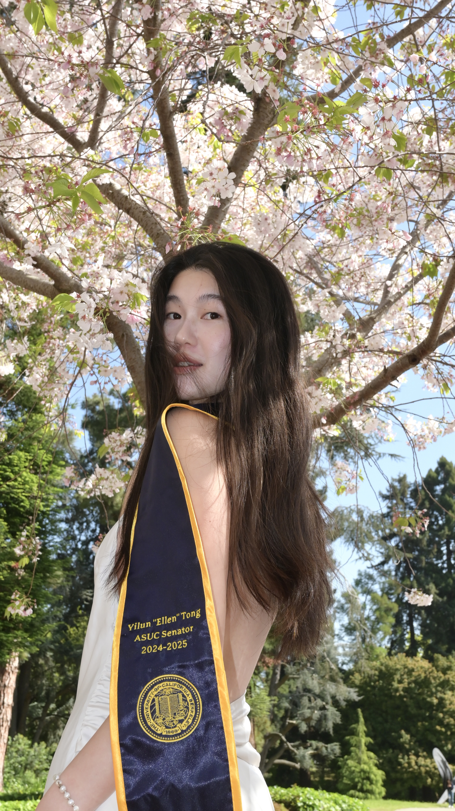

Hi all! My name is Ellen Tong. I grew up in Beijing, China and have been a proud international student since 2017. I recently graduated from the [University of California, Berkeley](https://www.berkeley.edu/), with a major in Psychology and a minor in Education. I am currently a student at the [Harvard Graduate School of Education](https://www.gse.harvard.edu/), concentrating in Human Development and Education.

If you’re interested in my **overall experiences** as an undergraduate (TLDR), please refer to my [CV](/files/tong-ellen-cv-spring26.pdf).

If you’re curious about my **academic and intellectual interests** and how I found my favorite field, please refer to my [Research](/research) page.

If you’d like to learn more about **who I am as a person** and what I did in my college community along the way, please refer to my [Student Leadership](/student-leadership) page.

