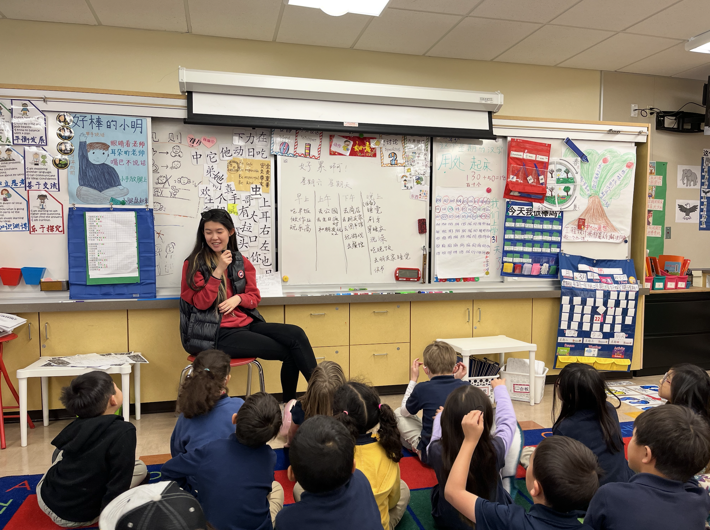
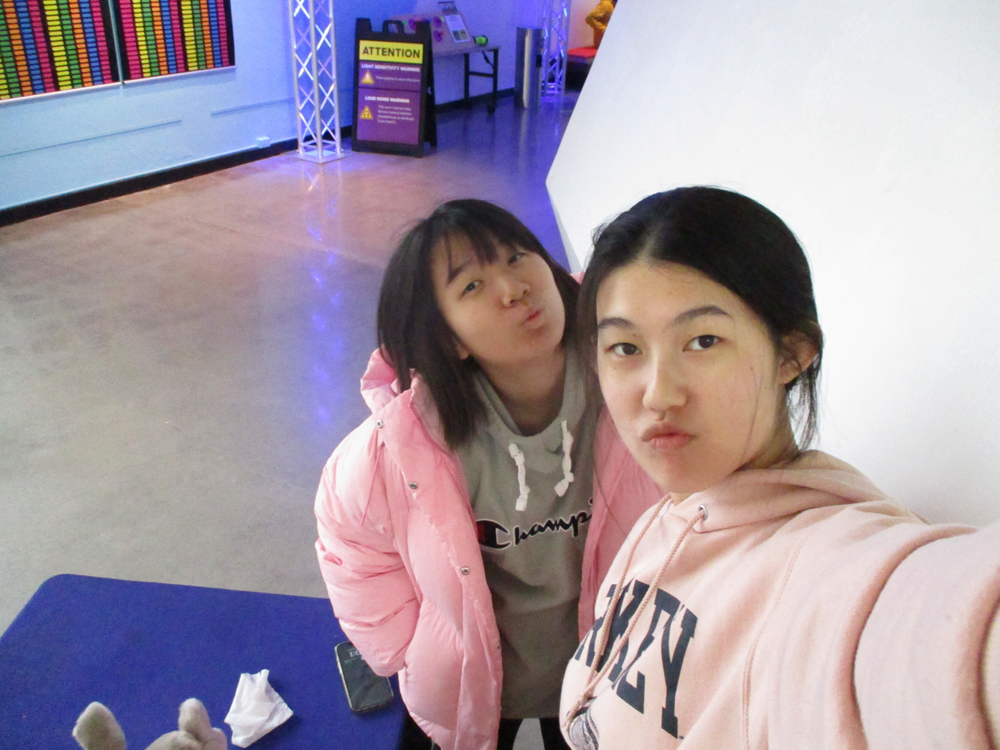
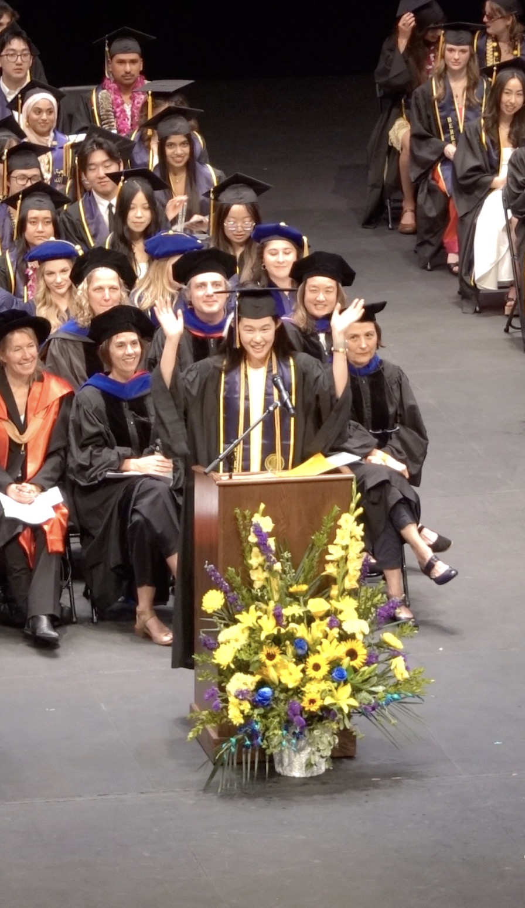

This page is still under development. I’ll be back soon with a more thoughtfully told story!

[← Back to Research](/research/)

I started babysitting in middle school and got along with every child I met. In addition to that, about half of my family members are current or former educators. From a very young age, I knew I wanted to work with young children and, as I grew older, that I wanted to study a related field.

Ironically, I had never thought I would pursue research until my third year in college, nor had I imagined attempting a PhD. For most of my family members, loving a group of people meant serving them in the most concrete ways possible. I agreed, and knew that research was probably not the most hands-on approach to serve children. For a long time, I imagined my future in a kindergarten or elementary school and felt a very strong pull toward teaching and leading a real classroom, and because I am an extrovert, no one ever doubted my goal.

  

 

At Berkeley, though, I only minored in Education and instead majored in Psychology because Berkeley did not offer an Education major when I enrolled. One day, I came across a “fields of psychology” tree diagram online and discovered developmental psychology. I had no idea what it meant, but I noticed that many developmental psychologists work with children. I thought that this might be the closest I can get to an Education major. That same semester, I enrolled in Developmental Psychology because I wanted to see what working with children looked like within psychology, since psychology was officially my college major.

Working with children looks entirely different in this new context. The class introduced me to research on the development of cognition for the first time. One study that has stayed with me ever since was the Mody & Carey (2016) cups paradigm, which examined whether young children can reason by disjunctive syllogism. I remember being so drawn to the task, and remembered the authors' names, even though I couldn’t quite explain why I was so interested at the time.

Admittedly, I still can't. I still find that moment somewhat magical. What I did feel, though, was that I could do similar things: that it is possible to study how babies and children think, quite rigorously, as a science. Because this way of working with children was so different from anything I had known before, the contrast itself drew me in. I decided to at least give research a chance.

By the time I finished my year in Prof. Steve Piantadosi’s Computation and Language Lab at Berkeley, where I worked on a project examining children’s ability to reason about algorithms and procedures, I had learned at least three things: (1) what it feels like to be a research assistant and how to carry out core RA responsibilities; (2) that I genuinely enjoyed the work I was doing and wanted to do more of it; and (3) that children are far more capable of cognitive reasoning than I had ever imagined from my classroom experiences. I was mesmerized because I left the lab knowing more about children in ways that felt even more fulfilling than spending an entire day with them.

 

 

In many ways, my research journey was shaped by serendipity. The summer before my senior year, I ended up working with a PhD student in Prof. Fei Xu's lab, who collaborated closely with Prof. Susan Carey when she was an undergrad and was continuing work on disjunctive syllogism. I began contributing to the very line of research that had first encouraged me to get my feet wet in developmental science.

At the same time that I began my research in Fei’s lab, my work in classrooms also led me to a realization that passion for serving children alone is not enough. Sometimes what we did in classrooms simply did not work, and when it didn’t, I often did not know how to fix it. Without a clear understanding of what children are capable of, and when (for example, in math skills or concept learning), I felt powerless. Reflecting on my experiences, I came to see that one can serve children in a more direct, concrete, and loving way yet remain somewhat uninformed and inefficient (like what I did in the classroom). Or, they can work from a distance while becoming increasingly informed -- closer to truth, and no less loving or passionate. Research.

I took an unexpected turn from the path I once imagined and chose the latter. I want to see through the minds of the very humans I hope to serve. Service can take many forms, but service without a thirst for understanding the very people one serves loses its depth. And so I carried on and found my footing in research. 

When I was awarded the Departmental Citation for my honors thesis and leadership, my belief in my ability to pursue research grew even stronger. Belief that I could do this, that I really do love this to a great extent, and that I belong in research just as much as I did in the classroom. I am deeply grateful for the support of my friends, family, mentors, and the young students who inspired this unexpected path, and I am proud of how far I have taken it.

 

 

[← Back to Research](/research/)
