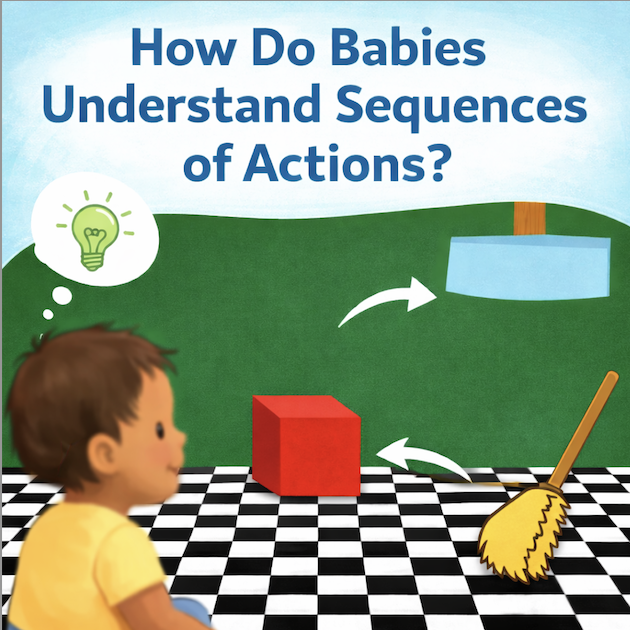
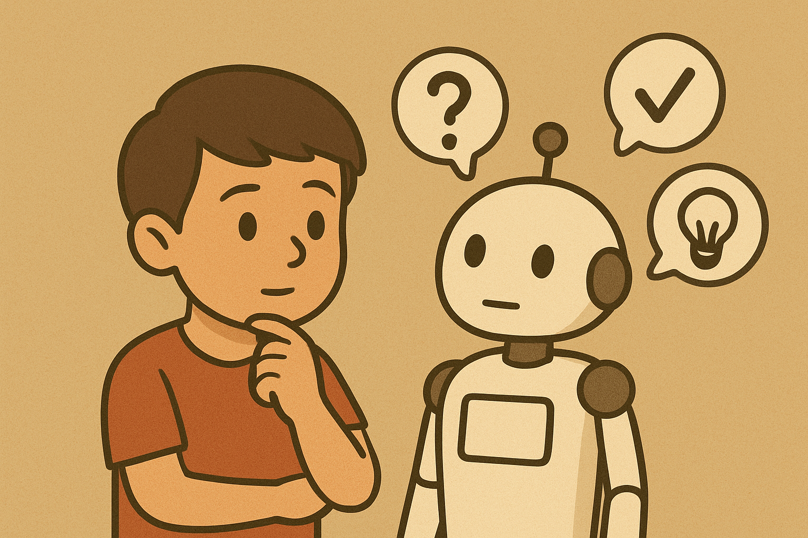

I have always enjoyed working with children in my research journey (feel free to read my [full story](research-story.md) for a more casual narrative). As an undergrad at UC Berkeley, I was a research assistant in the [Computation and Language Lab](https://colala.berkeley.edu/), and a lead research assistant and honors thesis student at the [Berkeley Early Learning Lab](https://babylab.berkeley.edu/). I wrote my honors thesis under the mentorship of Professor Fei Xu on young children's understanding of posterior probabilities ([thesis](/files/Tong-E-Thesis-Sp25.pdf); [poster](/files/tong-thesis-poster.pdf); you can also find details of my research below). I am currently a master's student at the Harvard Graduate School of Education, and have been a research assistant in the [Snedeker Lab](https://www.harvardlds.org/our-labs/snedeker-lab/) in the Department of Psychology and in the [Child-Centered AI Lab](https://childcenteredai.org/research/) at the Harvard Graduate School of Education since Fall 2025. These experiences have largely shaped my research interest. 

**I am broadly interested in how children make decisions in a highly complex and uncertain world.** At this stage, my interests are more exploratory than cohesive because I am eager to engage with multiple domains of cognition to better understand their interconnections. In particular, I am currently interested in the following questions:

1. When confronting uncertainty, do children reason logically (by simulating all possible outcomes) or probabilistically?

    * This interest was first inspired by a review article by [Denison & Xu (2019)](https://journals.sagepub.com/doi/10.1177/1745691619847201). This has sparked my interest in how children represent and reason about uncertainties since finishing my honors thesis.

2. My second question is a rather broad and actively debated question: How, if at all, do children reason using structured forms of thought (e.g., categorical or conditional syllogisms)? Does reasoning based on such structures require language? More broadly, what can empirical evidence reveal about the nature and format of these underlying "mentalese"?

    * This interest was inspired by my research in the Berkeley Early Learning Lab on a preschooler disjunction study, as well as recurring discussions in the Snedeker Lab surrounding the *Language of Thought* hypothesis.
    * My current mentor's project examining whether compositional thought precedes compositional language (a project to which I am actively contributing) is also a great source of inspiration.

3. As a curious extension of my honors thesis, I am interested in when children choose to override logically or probabilistically optimal decisions in favor of socially closer relationships, even when doing it entails a lower chance of successful helping.

    * This is a relatively new and still evolving idea for me. Broadly speaking, I am interested in how social forces shape and guide decision-making and hope to incorporate my research on children's reasoning into research on social cognition.

Currently, my research experiences and interests still feel somewhat siloed, but this in turn presents an exciting opportunity to continue learning across different areas of developmental cognition. My goal is to deepen both my theoretical knowledge and methodological skills so that I can make more informed decisions as I refine my research interests and eventually pursue my own independent lines of inquiry. I am so excited about the opportunities ahead. For now, though, feel free to check out what I have done in the past!

 

## Research Project Involvement

Please click on the dropdown with my research questions to check out details and/or abstracts of research projects I was involved in!

  
Probability Updating

  <b>Can children update their probabilistic judgments in light of new evidence (Berkeley Early Learning Lab; honors thesis)?</b>

  🏆 This is the topic of my honors thesis (<a href="../files/tong-thesis-poster.pdf">thesis</a >; <a href="../files/tong-thesis-poster.pdf">poster</a >). In this Departmental Citation-winning (1 out of ~500 psychology graduates) honors thesis, I investigate young children's ability to reason about posterior probabilities using a new method. The paper that inspired this study was written by <a href="https://www.sciencedirect.com/science/article/pii/S0010027707000613?via%3Dihub">Girotto & Gonzalez (2008)</a >.

  Across two experiments, 4- to 6-year-old children (n = 72) played a game where they had to guess the color of a block that a robot sampled from an opaque jar. Children made an initial guess about the blocks' color, followed by a second guess after being told new information regarding the block's shape (posterior probability judgment).

  I found that, contrary to previous research, children as young as 4 (who partially succeeded on the task) succeed at reasoning about posterior probabilities: they can make accurate probabilistic judgments and revise them based on new evidence. This suggests that the ability to reason about posterior probabilities may emerge earlier than previously thought. This is my first independent research project and I am still very proud of it!

  
Reasoning About Possibilities

  <b>Can children represent multiple incompatible possibilities? Do they possess modal concepts (Berkeley Early Learning Lab)?</b>

  It's fair to say research in this area has been shaped by serendipity. When I took my first developmental psychology course in my sophomore year, a single paper -- the Mody & Carey (2016) cups task -- introduced me to the field. Later, when I joined the Berkeley Early Learning Lab without a clear sense of what I would contribute, I ended up working on the very line of research that had first drawn me to developmental science.

  In this updated study, we designed a gumball machine task for three-year-olds (for a detailed description, please see my PhD student mentor's <a href="https://www.sciencedirect.com/science/article/pii/S0010027723001063">paper</a >). Three-year-olds were asked to choose between a gumball machine that <i>must</i> produce the gumball color of interest and the other machine that only <i>might</i> produce the color.

  If three-year-olds employ a modal representation of possibility, then they would select the gumball machine that <i>must</i> produce the desired color. We found that three year olds succeeded in our task, teasing apart what might be and what must be. Three-year-olds are therefore able to perform modal reasoning and represent what is *necessary* versus <i>possible</i>.

  It is also through this study that I became very familiar with participant recruitment and Zoom testing.

  
Compositionality

  <b>Does compositional thinking emerge before compositional language (Snedeker Lab)?</b>

  Language is compositional: we combine words into phrases, and phrases into sentences to convey meaning. In this study, we investigate whether infants can combine smaller units of information before they fully acquire language. We focus on the domain of physical reasoning, as prior research suggests that infants are capable of sophisticated reasoning in this domain early in development. Through this study, we explore the early conceptual building blocks that might later support language development.

  In this study that we are currently working on, we show infants two physical events: pushing a cube and smashing a cube. If infants can compose these two physical functions, then they would show a violation-of-expectation effect and look longer at the unexpected outcome. For example, if the cube first appears on the right of the screen and smashing occurs on the left of the screen, followed by pushing the cube from right to left, then infants should expect to see an intact cube ending up on the left of the screen after the occluder is lifted. On the contrary, if we reverse the order of the two physical functions, when infants should expect to see the cube, smashed, on the left side of the screen.

  
   
  Check out the cover I made for our study on Children Helping Science!
  
   

  Success on this task indicates that infants understand that the order of the functions can influence the outcome, ad would suggest an early ability to compose.

  
Children's Perception of Social Cues in Voice-Based Agents

  <b>Do verbal social cues impact children's judgments about the speaker's identity (human vs. AI; Child-Centered AI Lab at HGSE)?</b>

  I am currently involved in a project examining how verbal social cues that imply human-likeness (such as humor, praise, or expressions of gratitude) shape children’s judgments about the source of information provided by a voice-based agent.

  In this study, children aged 4 to 11 first hear a question and then listen to responses delivered by either human or AI-generated voices. Half of the responses include a social cue, while the other half do not. Children are then asked to judge whether the speaker providing the response is human or artificial.

  

  I contributed to the design of the pilot experiments and created the study using the experiment-building platform Gorilla. This is a side project that I found especially interesting!

