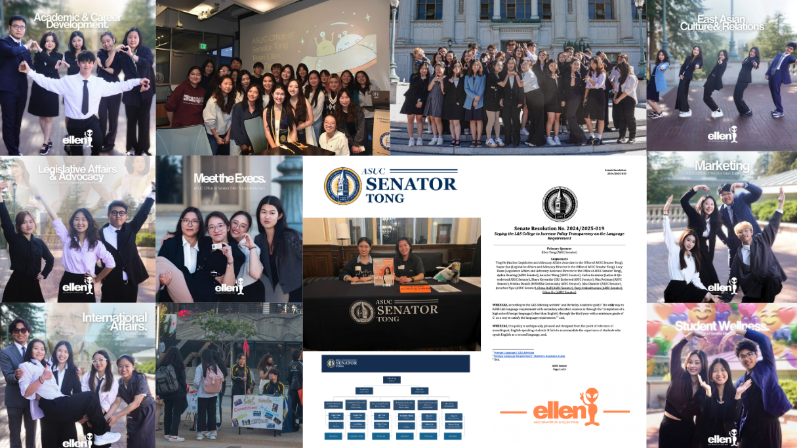
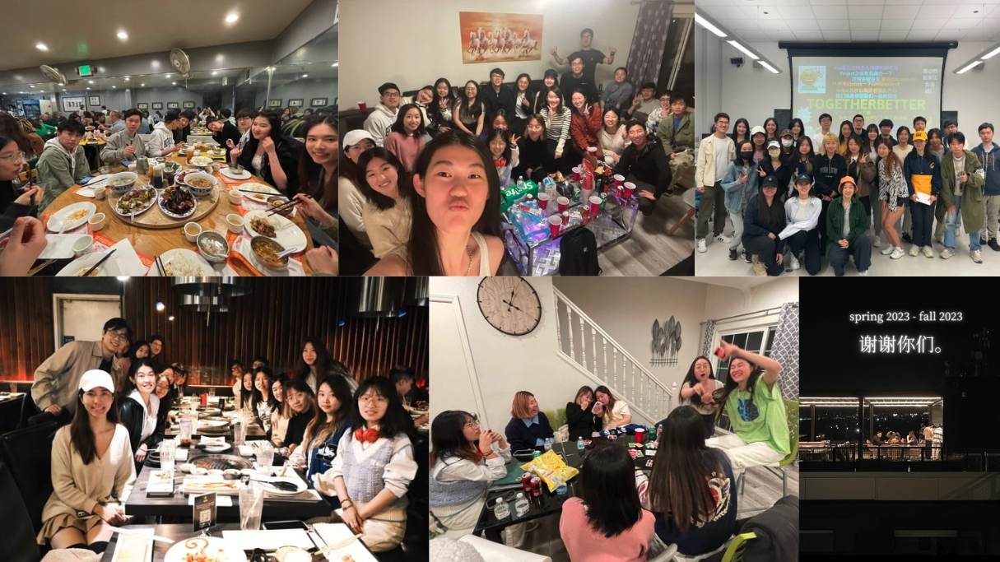
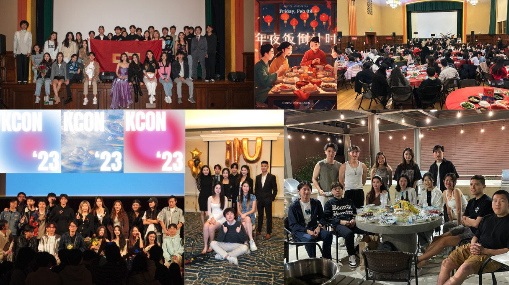

## Student governance

One of the earliest lessons I was taught by others about leadership is that it should begin within one’s own community, because leadership is most meaningful when grounded in a sense of belonging. For me, this work began in student government at UC Berkeley, where I worked with student body senators representing international students and East Asian communities, two groups I have considered my home away from home. By my senior year, I was elected as a senator myself, serving international students and East Asian-identifying students across campus.

Within student government, however, it is easy to fall into a particular trap. At the heart of student governance, it is often easy to be loud, but difficult to be precise; easy to lead and advocate, but difficult to do it with empathy. And at one point during my term, I realized that leadership can become overly entangled with abstract notions of a “community” at the expense of serving the very individuals who constitute it. *How do I make sure I am making a real impact beyond the podium and without the microphone?*

I came to realize that asking this question was itself the answer, so I kept it at the center of my work. Throughout the academic year, I managed the Office of Senator Ellen Tong, an office of 35 associates. Highlights of our work as an office include securing $300,000 in funding for the Berkeley International Office to expedite services for international students; authoring and passing a Senate resolution urging the College of Letters and Science to rename and restructure its “foreign language” requirement to better accommodate international students; and organizing East Asian community events that supported and advertised small businesses in the East Bay Area. Throughout my term in the academic year 2024-25, our office published more than 100 articles and social media posts, reaching over 10,000 individuals both within and beyond the communities we served. I also met some of my best friends, who I led and who, in turn, led me towards better leadership.

 

 
 

## Volunteer service organizing

Throughout my four years in college, I was involved in organizing volunteer programs that aimed to bridge educational resource gaps for children in China. Interestingly, I rarely appeared at the front of these efforts. Instead, I served as the internal vice president of my team and focused on organizing internal events and holding the group together. I learned more from this role than I expected.

First, I came to realize that while publicity matters in an educational organization, it means little without a team that feels connected and supported. I returned to the same question again and again: *What does it take to build a team where people feel safe to speak, to disagree, and to contribute honestly, even when we come from different backgrounds?* I organized large-scale team bonding events that allowed people to know one another beyond their roles. Inviting alumni from the Bay Area to join us helped situate our work within a longer history and reminded us that we were part of something larger than any single project.

Another lesson I have learned as I oversaw project team operations was that I became more aware of the privileges we carried into our leadership and organizing work. Good intentions can very well slip into something patronizing if left unchecked. Sometimes, we are too quick to judge and too reluctant to listen. This role asked me to listen more than I spoke, and to slow down when decisions felt too easy. If my time as a senator taught me how to advocate and speak up, this role taught me something different and equally lasting. I have learned to step back, stay grounded, and serve with humility.

 

 
 

## Large-scale community events

Beyond my more formal roles, I have always believed that college should leave room for joy; for people to spend time together and have fun. I began by attending and hosting informal gatherings in my apartment and at frat houses and ended up bringing my party instincts into these social spaces in a way that felt both positive and inviting.

Throughout my years in college, I organized or helped organize three of the largest singing competitions in my Chinese student community, held in campus auditoriums, as well as two Chinese New Year galas and four poker tournaments along with other miscellaneous events. I learned how to manage budgets, coordinate with campus partners, work with professional audiovisual and lighting teams, negotiate with external sponsors, and lead teams through the long and often chaotic process of turning plans into live events.

Being behind the scenes felt just as meaningful as standing on the stage as a senator. I like hearing the crowd cheer as I watch from the back of the room.

 

 
 

## Moving forward... ##

I have always believed that a research community should be as vibrant as a young campus, even if that vibrancy takes a quieter form sometimes. I often hear from my PhD friends that research can be tedious and extenuating work, but I want to make it as lively as possible both for myself and for those around me. My leadership experiences have given me both the pride and the humility to value collective effort, as well as the real capacity to help build that kind of environment.

I am grateful for the communities that have shaped me so far and I look forward to bringing these skills and sensibilities into research spaces as well.

