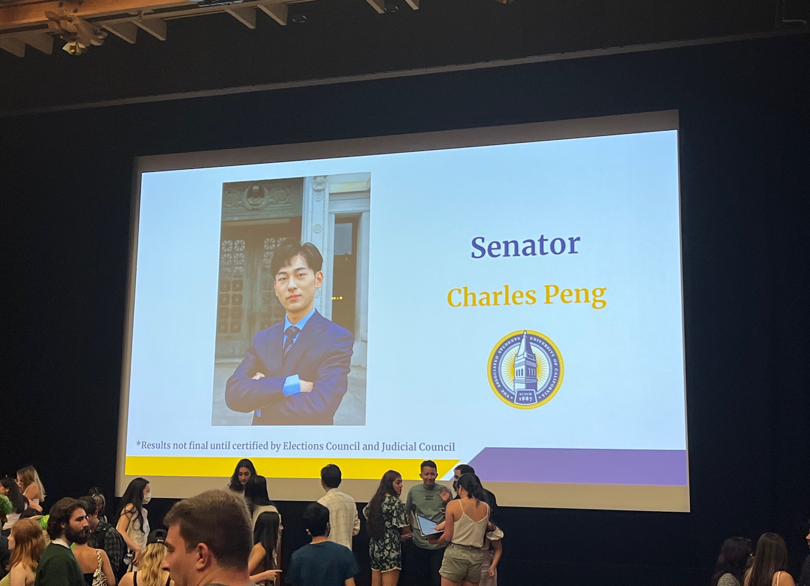
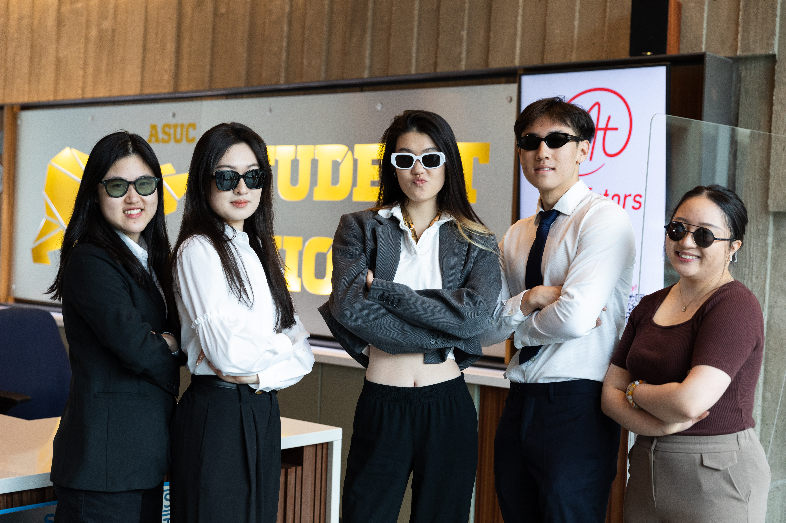
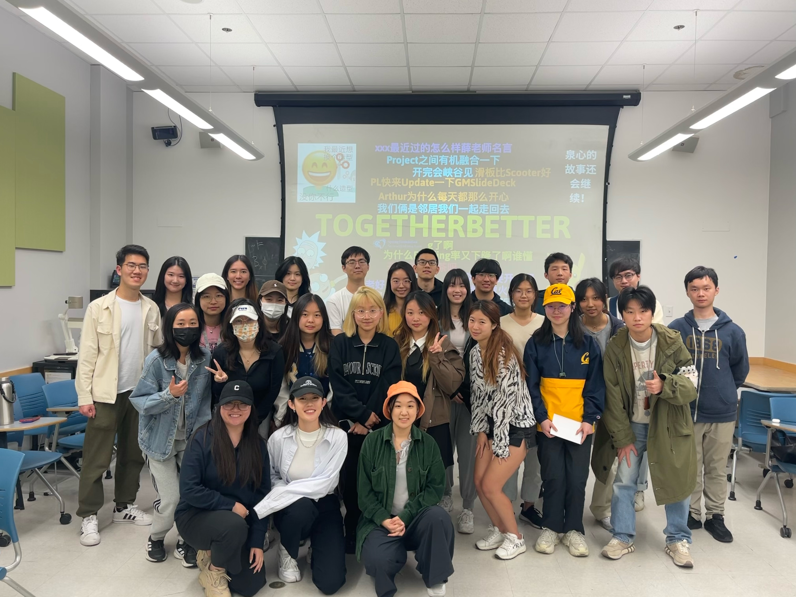
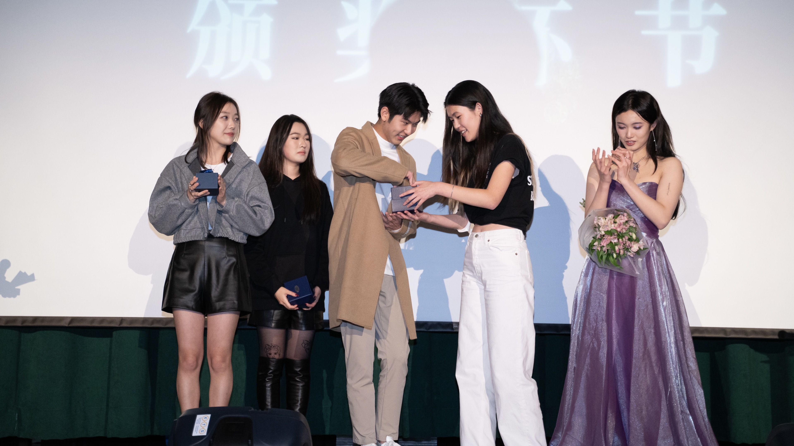
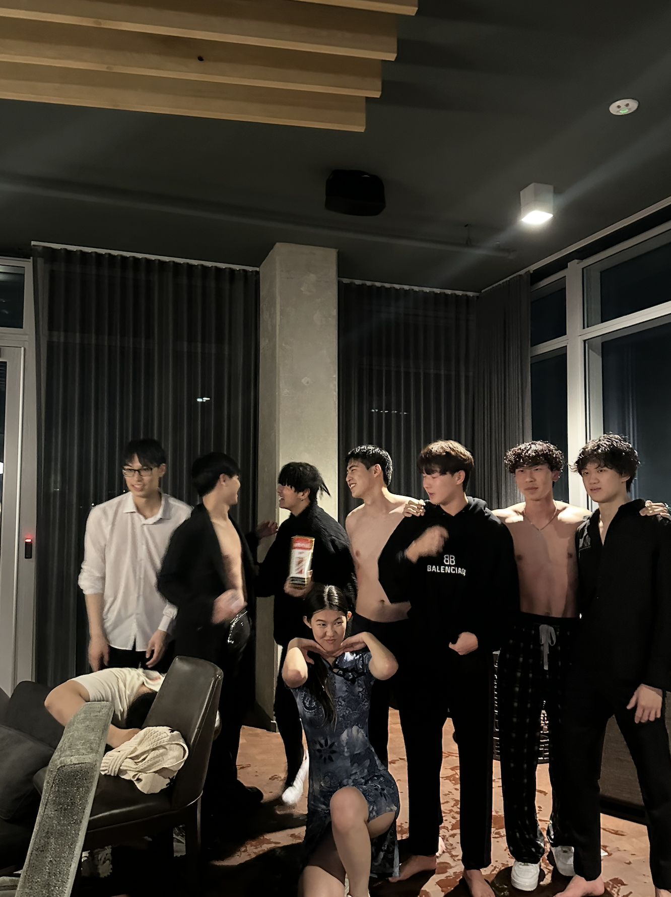
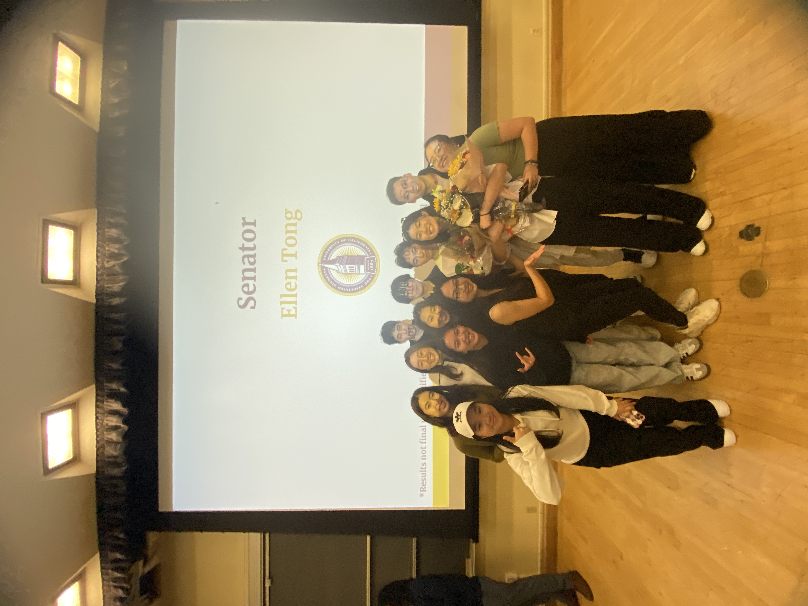
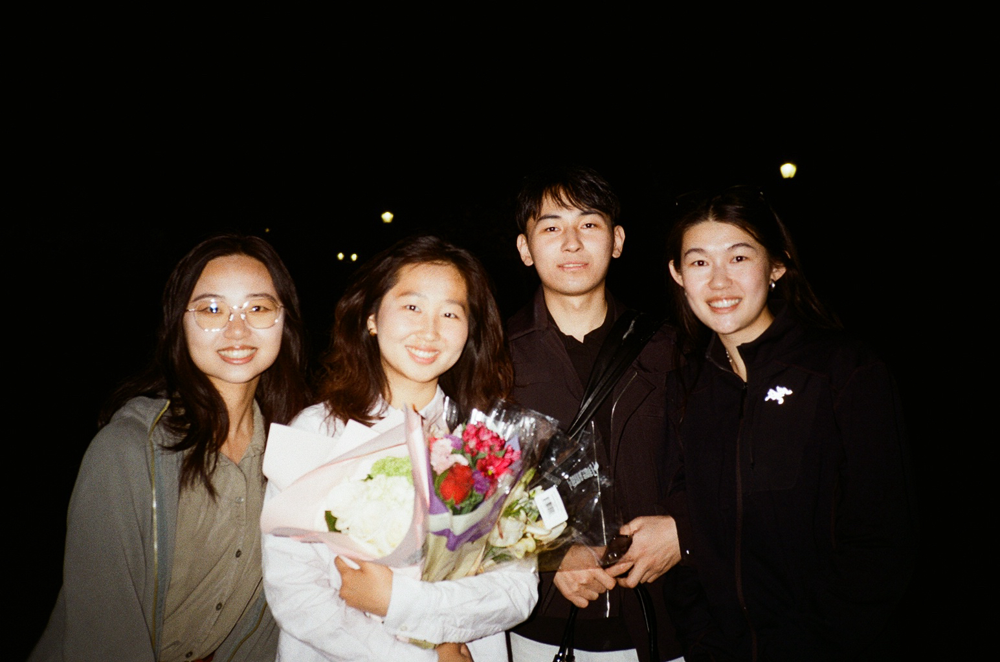
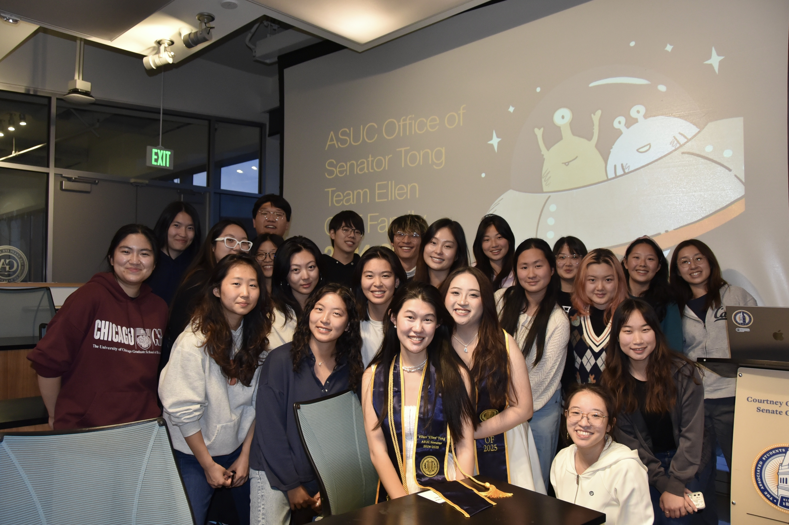

In high school, I somehow ended up with five different student leadership roles in one year. And ever since, the school hasn’t let anyone do that again. Technically, they were “leadership” positions, but most of what I did was just take directions from teachers and then tell my team to do the same thing. Still, it was fun. I was always surrounded by people and I kind of loved that. Of course, I wasn’t a leader. _But being a social butterfly was close enough,_ I thought.

When I got to college, I did turn into a total social butterfly – partly because of what I’d done in high school, and partly because I was just good at making friends. But it got a little out of hand. That first fall semester, I basically spent every night hanging out with people until seven in the morning, waking up at five in the evening, and starting my “day” when it was already dark outside. Now I weirdly miss that time when life didn’t have to make any f-ing sense.

In late fall 2021, my friend Charles told me about his terrifying plan to run for student senate. He educated me that it was called the Associated Students of the University of California, or the ASUC for short. _Oh, fancy,_ I thought, _but no thanks…?_ I laughed it off because it sounded impossible. Still, because I was the slightly more popular one I told him I’d help with his campaign if he actually did it, which he probably would not. I didn’t hate student government or anything. I just thought it was kind of a joke back then.

Charles’s campaign aside, by spring semester I started feeling like I should actually do something on campus. Something beyond bed rotting and endless hangouts that, back then, seemed meaningless to me (it now turns out they were not). But since I was good with people, I figured I’d start with student orgs and transition myself into the main campus themes. After getting rejected by every single club I applied to in the fall, I went for something less competitive. I went for the Chinese People Union, or CPU, an infamously chill student organization. I joined the culture department. I had no idea then that the CPU would end up being one of the most important parts of my college life, the place where I met some of my closest friends.

Back in early 2022, though, it turned out no one really did anything at CPU. It bugged me. So I told my department chair I wanted to throw an official CPU party and that I’d actually make it happen. Luckily they were super supportive. That April, my friend and I led the department in renting out a pub. Our chairs found some DJs. And somehow we pulled it off. With everyone’s support, I threw my first official party. At the time, I had a huge crush on this guy from my dorm and secretly hoped he’d show up. Honestly that was part of the reason I wanted to throw the party. He didn’t. I was sad. But I was still proud when people later called me a “very productive leader-wannabe.” I set my mind up to throw more parties with my team.

I also joined an organization called Spring Foundation, because it works to improve educational resources in my home country China. I joined with a specific purpose. I minored in Education, so I thought it would be helpful, to some extent, for my career. This is literally the entire reason why I decided to join an organization like this because my whole heart was at CPU. And unlike CPU, back then I felt that everyone here looked so introverted here, and I felt that I did not fit in. For the first semester in Spring, I floated in the periphery.

I also chose not to get involved because, as it turned out, my friend Charles actually won his internal election and officially became the ASUC senatorial candidate representing the East Asian and international student communities. That’s when I realized bro really meant it. That even back in the fall, when he first brought it up, he’d been serious. And I admired him for that.

_I hate student government, Charles,_ I said, _but I’m going to help you win this campaign._ It turned out my fall semester social butterfly era came full circle. Because I’d met so many people back then, I ended up DM’ing literally hundreds of them to vote for Charles.

Soon after, Charles gave me a “promotion,” and I became the outreach coordinator for a campaign team of about thirty people. I managed campaign support groups, sent out announcements and pep talks, and reached out to people like crazy. Charles joked that if I ever ran for Senate myself, I’d win by a landslide. I said heck no Charles, I hate student government.

In April 2022, Charles won his campaign and became a senator-elect. I screamed like crazy.

Charles and his chiefs of staff trusted me completely. The following fall, during my sophomore year, they appointed me as Charles’s Director of Community Relations in his Senate office. Normally, people had to spend a year working as an associate before landing a director role. I was so happy and honestly touched that Charles and his team believed in me, always hyping me up and saying good things to keep me going. Charles was (and still is) a good, endlessly supportive friend. We still talk even after graduation.

Anyway, in his office, I worked like crazy. I wanted to prove I could grow from nothing into a real director. I built and maintained connections with East Asian community organizations, helped host large campus events with hundreds of attendees, walked student clubs through funding and resource applications, and even mediated a few campus beefs.

Most importantly, I became close friends with my six Community Relations associates. Julia brought me dinner when I worked late. Bobby drove me home when I was tired. Emily made me laugh nonstop with her Dongbei-style 喊麦. Sabrina was like a big sister. Catherine always listened and was our in-house K-pop expert. And Kevin kept the whole office alive with Travis Scott. We were the most dynamic, chaotic, amazing team.

We eventually grew apart toward the end of college for many reasons, but I’ll always be grateful for that group. They and the work we did made me fall in love with the office, and even with student government, which I once thought was a joke. My department, my chiefs, Charles. They made it all worth it, despite whatever the public said about us. I grew as a leader precisely because of them.

That same year, riding the wave of all that momentum, I also became the vice chair of the culture department at CPU. I’d been the one constantly taking initiative, leading projects, hosting fun events, and throwing parties so it felt natural to step up. 

And then came Spring Foundation. With my confidence growing and my leadership instincts kicking in, I decided it was time to take another leap and get more involved there too. Spring was such a wholesome, quiet organization that I soon realized I might have been a little too ambitious – maybe even flamboyant, in how I worked. Around the people there, I learned that after you’ve thrown enough parties and done enough student politics, what you really need is a family to lean on.

I learned that you can’t rush greatness. It’s built from small, often boring pieces of hard work. I learned that you need both ideals and practicality to turn dreams into something real. The more time I spent with the team, the more it felt like home. Spring Foundation was a family, and it always would be. By sophomore year, I wanted to bring that same feeling to the new students. So I ran for Internal Vice President. I’ll admit I got the position partly by leveraging my popularity, but I really believed I was doing it for the right reason. That semester, I organized a big retreat and invited alumni to join us at a huge Airbnb. I watched sixty Springers – old and new – sitting together on couches, talking with their hearts open. My heart felt open and full too.

Soon after Charles retired from the Senate at the end of his term. His successor and my colleague H (who prefers to stay anonymous) decided to run to continue the office’s legacy. Her term would begin our junior year. I campaigned for her again. She won. I got promoted again. By that point, I also started shifting gears at the CPU. I stopped throwing parties just for fun and began thinking about how to create events that brought more people in. In ways that actually meant something. I ran for chair of the culture department and got it.

By my junior year I was juggling three big roles (along with some small roles I will omit on this page): External Chief of Staff for the Office of ASUC Senator H, Internal Vice President of Spring Foundation, and Chair of Culture at the Chinese People Union.

The first thing I did as chair at CPU was host a concert. Bruh it was so hard. Not because of the venue rental, the equipment, the coordination, the auditions, or the social media. It was hard because no one was doing anything. I ended up taking on everything myself until a few people finally showed up. We pulled the concert together, somehow. These people became some of my best friends for the rest of college and taught me how to look for the right people on the team.

After that I was basically unstoppable. I did graphic design, ran marketing, talked to sponsors, worked with teams, got uninvolved people re-engaged, hosted and joined bondings, got absolutely wasted after those bondings, and once even jumped into a pool with the CPU dudes after our banquet. I felt young again like a freshman, but this time it made sense because I had my people, my team, my rhythm.

Later that year, I helped host a Chinese New Year banquet with the same crew. We were way more experienced by then. The logistics, the venue, the performances. Everything clicked. It went beautifully. I finally had a fully functioning team and I was leading it. We worked hard, we had fun, and we had each other. 

Work in the student government got a little heated too, not only because of some of the geopolitical tensions that started to arise in the world (we tried our best to remain understanding but not involved in these, given our student status in this country), but also because the Berkeley International Office (BIO) was underfunded. International students therefore faced serious service delays. Along with H, we advocated for permanent funding of at least $700,000 for the international office. We partnered with the BIO director.

This work was very different from what I had done in the past in its professionalism, relevance, and urgency for one of the communities I served and belonged to. For the first time, I saw how hard it is to navigate the bureaucracy of a higher education institution. I also saw how hard it was to persuade the adults at a formal discussion table. That year, we didn’t secure funding for the international office. H’s term flew by quickly. She did a great job, but everyone was frustrated because of the funding stuff. But apparently, someone needed to keep going. To stay, to save our seat in the Senate, to wait for a potential harvest, even if we didn’t know whether the years ahead would be fruitful.

H said I should be that person. _Because if you want to stay in student government and keep doing the amazing community work you’ve been doing,_ she said, _the only way is to go up and be the senator yourself._ She encouraged me to be community-driven because she saw my great strength in that. She said I didn’t necessarily need a sharp political eye to serve as a public figure on campus. I quietly agreed.

We had this conversation by the same building where Charles and I had our first talk about the Senate in our freshman year. A full-circle moment. I boldly agreed, literally because of that. We all need some beautifully irrational moments in our early adulthood.

_Yes, boss,_ I said, _I am running for Senate._ She patted my shoulder and watched as I got on my bus back to my apartment in the chilly November wind.

So I started prepping promptly. By then, I had already retired from my role in Spring Foundation, so I decided to remain “dormant” until senior year spring, when things would get less hectic. By spring semester, I started writing my platforms (International Student Welfare; East Asian Community Development; Culturally-Competent Behavioral Health Resources). I began reaching out to my friends, classmates, and people I thought would be great for the campaign. I asked if they wanted to work for me. Unpaid, of course. It was all voluntary. I also started asking for personal endorsements from student leaders in my communities. I did not remember how many people I have talked to. Probably around a hundred in two months. The campaign was fun.

Once I had a team of around 25 people, I stopped recruiting and started planning my community initiatives. Because I knew I was rather popular, I didn’t put too much effort into outreach or community relations. It turned out to be a big mistake.

I underestimated the intensity of a campaign. I remember someone calling me while I was waiting in line at a Korean restaurant with my CPU friends. She scolded me madly for absolutely no reason. I cried in the back of the plaza where we ate. I remember my friends telling me that people in the caucus were saying bad things about me to stop me from being endorsed as the #1 candidate. That whole caucus meeting was designed to delegitimize my campaign. I cried again, but silently. _Ugh, student politics. A bunch of immature people pretending to be mature._ At least that was what I thought back then. People hate for no reason when there are conflicts of interest.

But I also remember crying in the library while H’s chiefs of staff hugged me, hiding me from others to give me a safe space. I remember my friends at CPU writing a surprise public article to fully endorse me and publicize my campaign. I remember Charles, H, and my campaign managers working alongside me day and night to get me elected. I remember the nights when I was so anxious I thought I needed to drink to escape it all. And my friends showed up outside my apartment, unannounced, just to give me hugs while I got absolutely drunk.

And because of that love – and even because of the “hate” (of course they didn’t really hate me; they were just scared, like everyone else during campaign season) – I got elected, and I ranked high. On tabulation day, as I ran onto the stage with tears in my eyes, I almost saw the freshman version of myself sitting in the back of the room in her party outfit, looking at me and smiling. We were both fearless and beautiful. The freshman me was fearless because she went out and did bold things to make herself fulfilled. I, too, was fearless as a senator-elect because I could now do the same for my community.

In my senior year, I retired from CPU. I had served long enough to become a senior advisor. I dedicated that entire year to my Senate office, along with my honors thesis, grad school applications, and classes.

Alas, running the Office of ASUC Senator Ellen Tong has been the most difficult and rewarding thing I have ever done. Despite all the chaos and “beefs” in my office, in the Senate, and across campus – which we managed to resolve with patience and maturity, we accomplished more than I ever imagined. We published over 100 articles, passed a Senate resolution, continued pushing for increased funding for the international office, and secured a temporary $300,000 (although we are far from our goal). We hosted countless community events, just as I had promised when I ran as a community-driven senator. I got to know more people, listened to their stories, and learned how to truly listen, without judgment, without defense. I helped my successor with her campaign. She got elected, too, and is currently serving as a Senator for the 2025-26 school year, helping the Berkeley International Office to continue securing the basic, stable funding it deserves.

I still don’t write legal documents that well, and I’m still learning what it means to be an advocate. Without my office, I am nothing. There, I met 35 incredible people who helped me, supported me, educated me, relied on me, made jokes and memes about me, and hugged me whenever I felt small.

They reminded me that I’m not just a senator. I’m also a student, a friend, a daughter, a little girl, even though everyone has called me “big sister” since junior year. I am so grateful. There isn’t a word big enough for it. I have never once regretted that beautifully irrational decision I made on that chilly November night to run for Senate.

I grew a ton from these experiences. And from the people, more importantly. They’ve taken me to Harvard, to all the top education schools in the United States, and to a more mature, more forgiving, more resilient version of myself.

Reflecting back, I realized that sometimes I don’t really like the word “leader,” because, to some extent, the word makes it easy to assume that others are just following. It doesn’t work that way. Every day I’m reminded of how deeply I’m loved by the people I’ve met and how inspired I am by the connections I’ve made. 

In one year, five years, ten years, and for the rest of my life, I hope I’ll still be surrounded by people who make me feel loved and inspired by the new connections I’ll create. And I hope I’ll continue to show my care and service to them as openly and unconditionally as I always have. 

So much shit happens in today’s world. If people can hate each other for no reason, my communities have reminded me that I can love in the same way.
